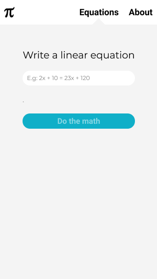
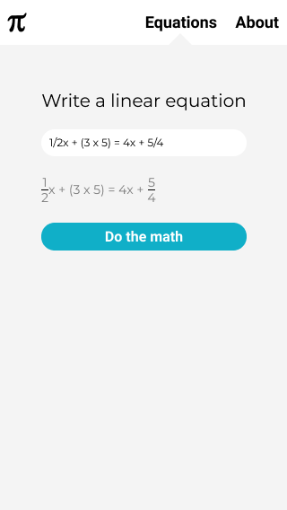
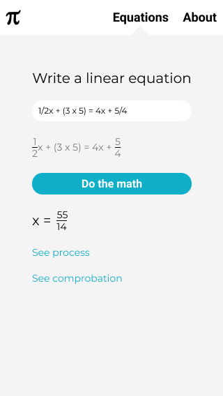

# equation-solver
equation-solver is supposed to solve and graph any kind of equation. However, the first iteration will only solve linear equations.

# Release date
The release date will be on July 28th, 2021

# Mobile mockup
The Figma mockup for mobile is similar to the ones in tablet and desktop. They must look like this:

